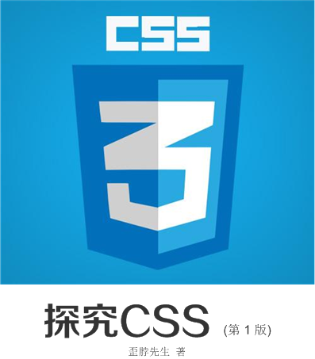

# 教程简介
《探究CSS》是一本开源的CSS教程，系统介绍整个CSS体系，全面涵盖CSS1、CSS2.1、CSS3， 并将整个CSS体系作为一个有机整体进行介绍，内容编排上，由浅入深，从基础讲起，逐步深入。   

   

## 版权声明
本教程采用[创意共享4.0](https://creativecommons.org/licenses/by-nc/4.0/)许可证。  

只要保持原作者署名和非商用，您可以自由地阅读、分享、修改本教程。  

如果您要修改本教程的内容，建议通知作者同步更新，本教程的不断完善，也有您的一份功劳。  
